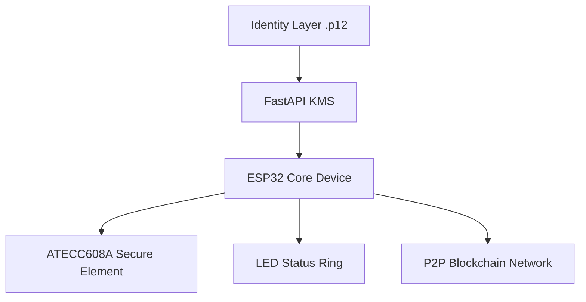

-->  ATECC608A (secure key element optional but recommended)
- WS2812 LED ring (network status)
- USB-C power + data
- LiPo battery (optional mobile mode)
- Flash storage (SPIFFS / external EEPROM
-
  ```mermaid

        [ LED RING ]
      ---------------------
     |   o o o o o o o    |
     |                   |
     |   ESP32 CORE      |
     |   + ANTENNA       |
     |                   |
     |  ATECC608A CHIP   |
     |                   |
      ---------------------
          USB-C PORT
```
```
```stl

                 ┌──────────────────────────┐
                 │  Web4 / FastAPI KMS      │
                 │  - sign / verify         │
                 │  - .p12 identity control │
                 └──────────┬───────────────┘
                            │ USB / WiFi
                            ▼
        ┌──────────────────────────────────────┐
        │   FADAKA CRYPTO CORE DEVICE         │
        │                                      │
        │  ESP32 + Secure Element             │
        │  LED Node Ring (WS2812)             │
        │  Identity Storage (.p12 / keys)     │
        │  Local Signing Engine               │
        └──────────┬───────────────┬──────────┘
                   │               │
                   ▼               ▼
          Wallet Layer      Blockchain Node Layer
                   │               │
                   └───────┬───────┘
                           ▼
                P2P Blockchain - ESP32-WROOM (main processor)

